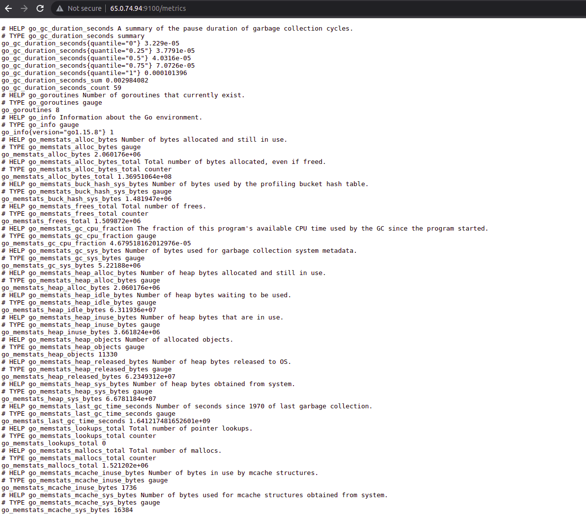

# Prometheus + Grafana Monitor Setup
=========

 This is an ansible playbook, that can be used for installing and setup prometheus and grafana on client servers, all that plays are using with inbuilt ansible modules.
 
 
Architecture
------------


 
 

# # Requirements
------------

- Install Ansible on your Master Machine

    - yum install ansible - Redhat based distribution

    - apt install ansible - Debian based distribution
    
    - amazon-linux-extras install ansible2 - on amazon-linux ec2 instances

 - Ansible Modules used

    - yum
    - service
    - copy
    - file
    - template
    - unarchive
    - command


# # Steps Included
--------------

1. One Master server for ansible, 2 node-exporters and one server with prometheus and grafana installed

2. Ports

    - Port 9090:- Prometheus Server

    - Port 9100:- Prometheus Node Exporter

    - Port 3000:- Grafana

3. Setup inventory file and copy the private key on master server(change the permission as well)

```
#vi inventoryfile.txt

[node_exporters]

serverip ansible_user="username" ansible_ssh_private_key_file="ansible.pem"
serverip ansible_user="username" ansible_ssh_private_key_file="ansible.pem"


[prometheus]

serverip ansible_user="username" ansible_ssh_private_key_file="ansible.pem"

```

4. node-exporter:

```

1.Downloading and extracting node-exporter on server
2.Copying that binary file to /usr/local/bin/
3.Creating node_exporter user to run the node exporter service.
4.Adding neccessary service file content to the node-exporter service file.
5.Once done reload the daemon and restart the service

```

5. Prometheus:

```

Use the below steps to download and extract prometheus on server,

1.Downloading and extracting prometheus on server
2.Creating a Prometheus user, required directories, and make prometheus user as the owner of those directories.
3.Copying prometheus and promtool binary from prometheus folder to /usr/local/bin and change the ownership to prometheus user.
4.Moving the consoles and console_libraries directories from prometheus folder to /etc/prometheus folder and change the ownership to prometheus user.
5.Adding neccessary contents to prometheus configuration file and changing the ownership.
6.Adding neccessary service file content to the prometheus service file.
7.Once done reload the daemon and restart the service

```

6. Grafana:


```

1. Adding the repo for grafana installation
2. Install, restarting and enabling grafana
3. Dashboard setup


Once this is done we can load the below url for getting prometheus panel,

http://serverip:9090/targets


We can access the grafana using the below url,

http://serverip:3000


username:admin
password:admin

```

****************
Grafana Dashboard setup::
****************

```

1. Select the Data sources tab and add the name and in the url section add the private ip or localhost of the server, since we have installed grafana and prometheus on same server.

http://privateip:9090

then click save & test

2. for getting the dashboard view we can import the dashboard file,

click on + symbol on right side, then click on import.. enter 1860 in the "import via grafana.com" section and click load.

once it is done select the data source we have created earlier

```

# # Variables Used
------------
```

---

node_user: "node_exporter"
prometheus_user: "prometheus"
node_exporter_url: "https://github.com/prometheus/node_exporter/releases/download/v1.1.2/node_exporter-1.1.2.linux-amd64.tar.gz"
prometheus_url: "https://github.com/prometheus/prometheus/releases/download/v2.32.1/prometheus-2.32.1.linux-amd64.tar.gz"

server_ips:
  - first server ip
  - seconf server ip

```

# # Sample Playbook
----------------

Including an example of how to use your role (for instance, with variables passed in as parameters) is always nice for users too:

Node-exporter:

```

# cat node-exporter-setup.yml 
- name: "Installing node-exporter"
  hosts: node_exporters
  roles:
    - node_exporter
  become: true
  vars:
    node_exporter_url: "https://github.com/prometheus/node_exporter/releases/download/v1.1.2/node_exporter-1.1.2.linux-amd64.tar.gz"
  tasks:

  
    - name: "downloading and unzipping the node-exporter file"
      unarchive:
        src: "{{ node_exporter_url }}"
        dest: /opt/
        remote_src: yes

    - name: "Moving file contents"
      command: mv /opt/node_exporter-1.1.2.linux-amd64 /opt/node_exporter


    - name: "Copying file"
      copy:
        src: /opt/node_exporter/node_exporter
        dest: /usr/local/bin/
        remote_src: yes
        mode: '0755'
    
    - name: "Post-Installation - CleanUp"
      file:
        path: "{{ item }}"
        state: absent
      with_items:
        - "/opt/node_exporter.tar.gz"
        - "/opt/node_exporter"


# cat prometheus_tasks.yml 
---

- name: "Installing prometheus"
  hosts: prometheus
  roles:
    - prometheus
  become: true
  vars:
    prometheus_url: "https://github.com/prometheus/prometheus/releases/download/v2.32.1/prometheus-2.32.1.linux-amd64.tar.gz"
    prometheus_user: "prometheus"
    
  tasks:

    - name: "Downloading prometheus and installing prometheus"
      unarchive:
        src: "{{ prometheus_url }}"
        dest: /opt/
        remote_src: yes


    - name: "Moving file contents"
      command: mv /opt/prometheus-2.32.1.linux-amd64 /opt/prometheus

    - name: "Creating directories"  
      file:
        path: "{{ item }}"
        state: directory
        owner: "{{ prometheus_user }}"
        group: "{{ prometheus_user }}"
      with_items:
        - /etc/prometheus
        - /var/lib/prometheus

    - name: "Copying files to binary"
      copy:
        src: "{{ item }}"
        dest: /usr/local/bin/
        remote_src: yes
        owner: "{{ prometheus_user }}"
        group: "{{ prometheus_user }}"
        mode: '0755'
      with_items:
        - /opt/prometheus/prometheus
        - /opt/prometheus/promtool


    - name: "Copying files"
      copy:
        src: "{{ item }}"
        dest: /etc/prometheus
        remote_src: yes
        owner: "{{ prometheus_user }}"
        group: "{{ prometheus_user }}"
      with_items:
        - /opt/prometheus/consoles
        - /opt/prometheus/console_libraries


    - name: "Copying prometheus_config file"
      template:
        src: /etc/ansible/roles/prometheus/templates/prometheus_config.j2
        dest: /etc/prometheus/prometheus.yml
        owner: "{{ prometheus_user }}"
        group: "{{ prometheus_user }}"


    - name: "Copying prometheus service file"
      template:
        src: /etc/ansible/roles/prometheus/templates/prometheus.service.j2
        dest: /etc/systemd/system/prometheus.service
        owner: "{{ prometheus_user }}"
        group: "{{ prometheus_user }}"
    
    - name: "Restarting and enabling prometheus service"
      service:
        name: "{{ prometheus_user }}"
        state: restarted
        enabled: true

# cat grafana-setup.yml 
---

- name: "Installing Prometheus"
  hosts: prometheus
  become: true
  roles:
    - grafana
  tasks:

    - name: "Installing grafana"
      yum:
        name: grafana
        state: present

    - name: "Restarting grafana"
      service:
        name: grafana-server
        state: restarted
        enabled: true


```

# # Outputs:
------------------





# # Conclusion:
------------------

This playbook will help you to install and setup prometheus and grafana and the setup needs one master , one server for prometheus and grafana and two servers as node-exporters(the servers we monitor)
